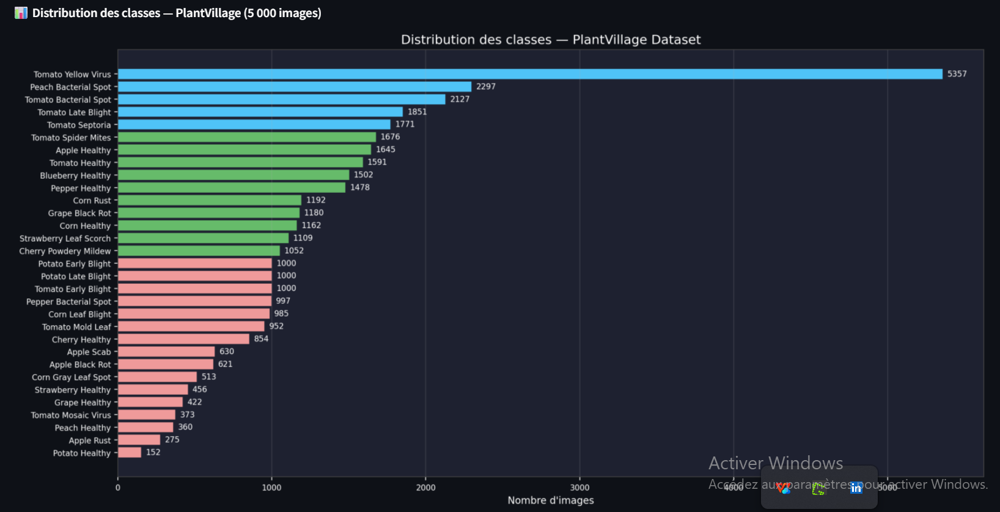
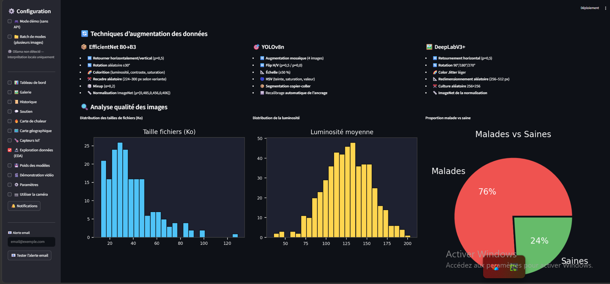
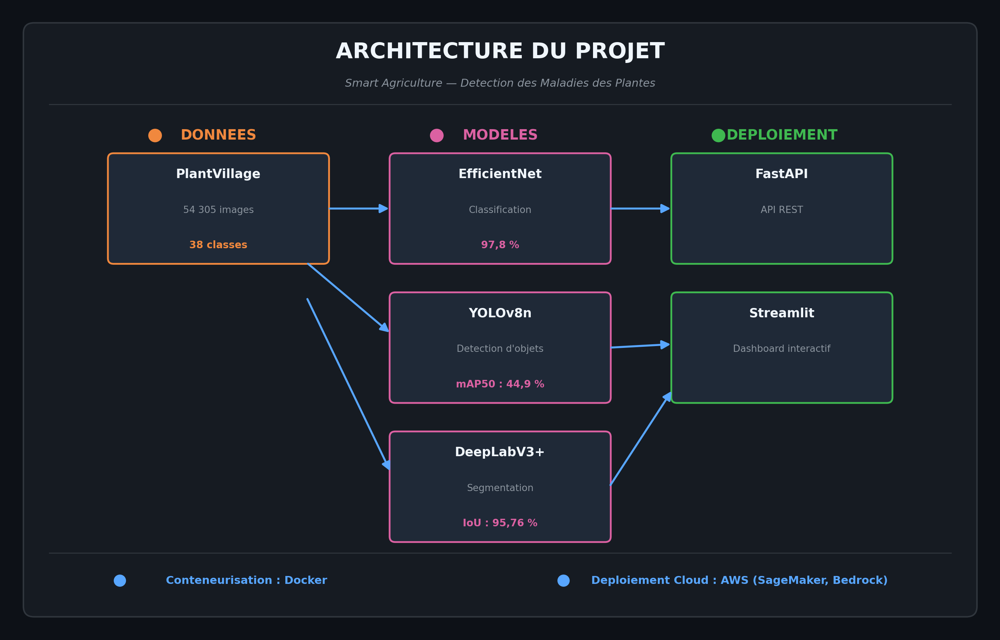
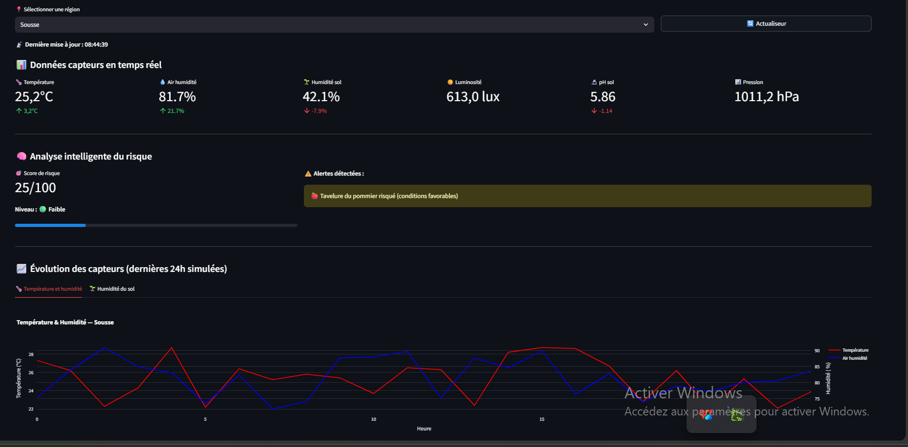

# 🌱 Smart Agriculture - Détection des maladies des plantes

---

## 📌 Contexte du projet

Les agriculteurs tunisiens subissent des pertes de rendement importantes dues aux maladies des plantes, mais la **détection manuelle est lente et coûteuse**.

**Objectif** : Concevoir un système de vision par ordinateur pour **détecter et segmenter automatiquement** les maladies foliaires.

---

## 📊 Dataset

| **Caractéristique** | **Valeur** |
|---------------------|------------|
| **Nom** | PlantVillage |
| **Images** | 54 305 images |
| **Classes** | 38 classes de maladies |
| **Format** | JPG, RGB |

### Distribution des classes

---

## 🧠 Modèles utilisés

| **Tâche** | **Modèle** | **Performance** |
|-----------|------------|-----------------|
| Classification | EfficientNet B0-B3 | **97,8% accuracy** |
| Détection d'objets | YOLOv8n | **mAP50: 44,9%** |
| Segmentation sémantique | DeepLabV3+ | **IoU: 95,76%** |

---

## 📈 Résultats détaillés

### Matrice de confusion

### Métriques par classe

### Graphiques d'analyse

---

## 🏗️ Architecture du projet

Le système est composé de 3 modules principaux :

| **Module** | **Modèle** | **Performance** |
|------------|------------|-----------------|
| **Classification** | EfficientNet B0-B3 | **97,8% accuracy** |
| **Détection d'objets** | YOLOv8n | **mAP50: 44,9%** |
| **Segmentation** | DeepLabV3+ | **IoU: 95,76%** |

L'ensemble est déployé via une **API FastAPI** et un **dashboard Streamlit**.

---

## 📸 Dashboard Streamlit

### Page d'accueil

### Page de connexion

### Paramètres

### Capteurs IoT

### Statistiques globales du dataset

---

## 🎥 Vidéo de démonstration

[▶️ Regarder la démonstration complète du projet (10:16)](https://drive.google.com/file/d/1D3X0OknKJvb_A9PUGH0aEeouIggXTfbv/view?usp=sharing)

---

## 🏗️ Structure du projet
